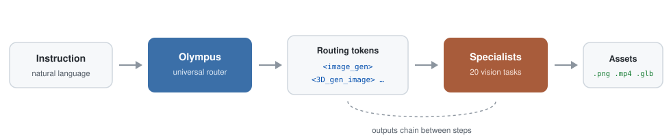

<div align="center">


# Olympus: A Universal Task Router for Computer Vision Tasks

**CVPR 2025 (Highlight)**

[](https://arxiv.org/pdf/2412.09612)
[](https://arxiv.org/abs/2412.09612)
[](https://yuanze-lin.me/Olympus_page/)
[](https://huggingface.co/Yuanze/Olympus)
[](https://huggingface.co/datasets/Yuanze/Olympus)
[](https://www.youtube.com/watch?v=N1xOdIrVvn4)

[Yuanze Lin](https://yuanze-lin.me/) &nbsp;·&nbsp; [Yunsheng Li](https://scholar.google.com/citations?user=hJrIyCwAAAAJ&hl=en) &nbsp;·&nbsp; [Dongdong Chen](https://www.dongdongchen.bid/) &nbsp;·&nbsp; [Weijian Xu](https://weijianxu.com/) &nbsp;·&nbsp; [Ronald Clark](https://www.ron-clark.com/) &nbsp;·&nbsp; [Philip H. S. Torr](https://eng.ox.ac.uk/people/philip-torr/)

[**Installation**](#install) &nbsp;·&nbsp; [**Models & Data**](#data) &nbsp;·&nbsp; [**Inference**](#specialists) &nbsp;·&nbsp; [**Training**](#training) &nbsp;·&nbsp; [**Evaluation**](#evaluation) &nbsp;·&nbsp; [**Citation**](#citation)

</div>

Official implementation of "Olympus: A Universal Task Router for Computer Vision Tasks".

Olympus routes a single natural-language instruction across **20 vision tasks**,
dispatches each to a specialist model, and chains their outputs. One prompt in,
finished `.png`, `.mp4` and `.glb` files out.

**:hearts: If you find our project is helpful for your research, please kindly give us a :star2: and cite our paper :bookmark_tabs:   : )**

## :mega: News

- [x] **Prompt to output.** A single instruction now returns finished assets, `.png` / `.mp4` / `.glb`.
- [x] Release the code for integration with task-specific models.
- [x] Release the training & inference code.
- [x] Release Olympus datasets.
- [x] Release the model of Olympus.

## :low_brightness: Overview


## :hammer_and_wrench: Installation <a href="#install" id="install"/>

To establish the environment, just run this code in the shell:

```
git clone https://github.com/yuanze-lin/Olympus.git
cd Olympus
conda create -n olympus python==3.10 -y
conda activate olympus
pip install -r requirements.txt
```

That will create the environment ```olympus``` we used.

That is all you need to run the router on its own. To also **execute** the routed
tasks and generate real images, videos and 3D models with
[`run_tools.py`](#specialists), install the specialist stack into the *same*
environment:

```
pip install torch==2.6.0 torchvision==0.21.0 --index-url https://download.pytorch.org/whl/cu124
pip install -r requirements_tools.txt
bash scripts/install_specialists.sh
```

The router and every specialist share this one environment; there is no per-tool
environment to manage.

### 3D backends

`<3D_gen_image>` uses [TRELLIS.2-4B](https://huggingface.co/microsoft/TRELLIS.2-4B)
and `<3D_gen_text>` uses [TRELLIS-text-base](https://huggingface.co/microsoft/TRELLIS-text-base),
both producing textured meshes with PBR materials. They compile several CUDA
extensions, so they install separately:

```
bash scripts/install_3d.sh
```

That builds both, plus Hunyuan3D-2 as an ungated fallback for `<3D_gen_image>`.
Each step is independent, so a failure in one does not block the others, and any
3D token whose backend is missing falls back automatically rather than erroring.
See the [3D fallbacks](docs/SPECIALISTS.md#3d-fallbacks).

> **TRELLIS.2-4B needs two gated Hugging Face repos at runtime:**
> [`facebook/dinov3-vitl16-pretrain-lvd1689m`](https://huggingface.co/facebook/dinov3-vitl16-pretrain-lvd1689m)
> (image conditioning) and [`briaai/RMBG-2.0`](https://huggingface.co/briaai/RMBG-2.0)
> (background removal). Accept both licenses on the Hub while logged in
> (`huggingface-cli login`) and nothing else is needed.
>
> If your request is rejected, obtain the weights locally (see
> [microsoft/TRELLIS.2#38](https://github.com/microsoft/TRELLIS.2/issues/38)) and
> point at the folders:
> ```
> DINO_MODEL_PATH=/path/to/dinov3-vitl16-pretrain-lvd1689m \
> SEG_MODEL_PATH=/path/to/RMBG-2.0 \
>   python run_tools.py --prompt "..." --input-image assets/room.jpg
> ```
> The Hub call is tried first; these apply only if it fails. Or skip TRELLIS.2 and
> let `<3D_gen_image>` fall back to Hunyuan3D-2, which is ungated.

## :floppy_disk: Models & Data <a href="#data" id="data"/>

We share our collected Olympus dataset as follows:

| Instruction    | Link |
|---------|------|
| Olympus Dataset | [Olympus_dataset](https://huggingface.co/datasets/Yuanze/Olympus) |
| Olympus Fine-tuning Data | [Olympus.json](https://huggingface.co/datasets/Yuanze/Olympus/blob/main/Olympus.json) |

- ```Olympus_dataset```: There are 20 JSON files under ```20 individual tasks``` folder, each corresponding to a specific task. You can refer to the routing token definitions in our paper to identify the task associated with each JSON file, along with the chain-of-action data provided in ```coa.json```. Each of these 21 JSON files includes both training and test data. ```OlympusInstruct.json``` and ```OlympusBench.json``` contain the collected OlympusInstruct and OlympusBench datasets, respectively.
- ```Olympus.json```: The final instruction data for fine-tuning.

**(1) Download the Olympus model:**

```
python download_olympus.py
```

It will save the ```Olympus``` model under the ```ckpts``` folder.

**(2) Download the Olympus data for fine-tuning:**

```
python download_olympus_dataset.py
```

It saves the fine-tuning instruction data ```Olympus.json``` to the ```train_data``` folder, while all other JSON files are stored in the newly created ```jsons``` folder. Note that ```Olympus.json``` is a combination of ```llava_v1_5_mix665k.json``` and OlympusInstruct, our collected instruction data covering 20 tasks.

If you want to merge the data manually, download [llava_v1_5_mix665k.json](https://huggingface.co/datasets/liuhaotian/LLaVA-Instruct-150K/blob/main/llava_v1_5_mix665k.json) into the ```jsons``` folder, then run the merge script:

```
python scripts/merge_data.py
```

You can specify which tasks to merge by referring to the script ```scripts/merge_tasks.py```.

**(3) Download the Mipha-3B model for fine-tuning:**

```
python download_mipha_3b.py
```

It will save the ```Mipha-3B``` model under the ```ckpts``` folder.

## :rocket: Inference <a href="#specialists" id="specialists"/>

A single instruction becomes finished files. Olympus parses it into routing
tokens, dispatches each to its specialist, and resolves the dependencies between
them, so no step has to be wired up by hand.

<p align="center">
  
</p>

### Quick start

```
python run_tools.py \
  --prompt "Generate an image of a fluffy orange cat lounging on a windowsill, \
with sunlight streaming through the glass and casting soft shadows to create a cozy atmosphere. \
Next, would it be possible to change the cat's color to white? This change will make it more eye-catching. \
In the following step, produce a high-resolution 3D model based on the modified image. \
At the next point, please show a video of a cat and a dog running on a playground." \
  --model-path ckpts/Olympus --output-dir outputs/cat
```

The plan is printed before anything loads. `<- step N` is a resolved dependency:
the edit runs on the generated image, and the mesh is built from the edited one.

```
Execution plan:
  [0] <image_gen> via qwen_image
        "a fluffy orange cat lounging on a windowsill, ..."
  [1] <image_edit> via qwen_image_edit  <- step 0
        "change the cat's color to white."
  [2] <3D_gen_image> via trellis2  <- step 1
        "produce a high-resolution 3D model based on the modified image."
  [3] <video_gen> via wan_video
        "a cat and a dog running on a playground."
```

```
outputs/cat/
├── step0_image_gen.png          # Qwen-Image
├── step1_image_edit.png         # Qwen-Image-Edit-2511, edits step 0
├── step2_3D_gen_image.glb       # TRELLIS.2-4B, built from step 1
├── step2_3D_gen_image.mp4       # turntable render of the mesh
├── step2_3D_gen_image_pbr.mp4   # same turntable, PBR channels tiled
├── step3_video_gen.mp4          # Wan2.2-TI2V-5B
├── plan.json                    # parsed routing tokens + dataflow
└── manifest.json                # model, timing and inputs per step
```

Measured on a single 48 GB GPU:

| Step | Specialist | Time |
|:--|:--|--:|
| `<image_gen>` | Qwen-Image | 125 s |
| `<image_edit>` | Qwen-Image-Edit-2511 | 182 s |
| `<3D_gen_image>` | TRELLIS.2-4B | 296 s |
| `<video_gen>` | Wan2.2-TI2V-5B | 190 s |

Specialists load one at a time and each is freed before the next, so peak memory
is roughly a single model rather than the sum. A step that fails is recorded in
`manifest.json` and the rest still run.

### Working from your own image

Tasks that analyse or edit an image take one directly:

```
python run_tools.py --prompt "Segment everything in this photo, then estimate its depth map." \
  --input-image assets/room.jpg --output-dir outputs/room
```

### Options

| Flag | Purpose |
|:--|:--|
| `--dry-run` | print the plan, no GPU needed |
| `--list-tokens` | all 30 tokens and their backends |
| `--input-image path.png` | seed image for edit/analysis tasks |
| `--router-output "<image_gen>...</image_gen>"` | skip the router, run tokens directly |
| `--plan outputs/cat/plan.json` | re-run a saved plan |
| `--legacy-backends` | use the paper's Table 9 specialists |
| `--backend-model image_gen=<hf-id>` | swap a single checkpoint |
| `--step-option video_gen.num_frames=25` | per-token knobs |

Weights stream from the Hub on first use, ~200 GB across every token, so set
`HF_HOME` to a large disk. `python scripts/prefetch_specialists.py` fetches them
ahead of time, and `python scripts/smoke_test_tokens.py --fast` exercises all 30
tokens to verify an install.

All 30 tokens, their specialists, the 3D fallbacks, licensing and dependency pins
are listed in [docs/SPECIALISTS.md](docs/SPECIALISTS.md).


## :books: Training <a href="#training" id="training"/>

Please refer [here](https://github.com/haotian-liu/LLaVA/blob/9a26bd1435b4ac42c282757f2c16d34226575e96/README.md#visual-instruction-tuning) to prepare the instruction tuning data. Especially, store the images from different datasets under ```train_data``` folder.

Run the following code to fine-tune the model:

```
bash scripts/mipha/finetune.sh
```

## :bar_chart: Evaluation <a href="#evaluation" id="evaluation"/>

To evaluate the model's performance on different benchmarks, see [Evaluation.md](https://github.com/haotian-liu/LLaVA/blob/main/docs/Evaluation.md).

Please place the evaluation data under the ```eval``` folder. The evaluation scripts are placed under ```scripts/mipha/eval/```.
For example, to test the model's performance on VQAv2 dataset, simply run:

```
bash scripts/mipha/eval/vqav2.sh
```

## :crystal_ball: Supported Capacities (Covering 20 tasks)


## :snowboarder: Diverse Applications


## :bookmark_tabs: Citation <a href="#citation" id="citation"/>

If you find Olympus useful for your research and applications, please cite using this BibTeX:

```
@article{lin2024olympus,
  title={Olympus: A Universal Task Router for Computer Vision Tasks},
  author={Lin, Yuanze and Li, Yunsheng and Chen, Dongdong and Xu, Weijian and Clark, Ronald and Torr, Philip HS},
  journal={arXiv preprint arXiv:2412.09612},
  year={2024}
}
```

## :pray: Acknowledgement

Our project is built upon the following foundations:

- [Mipha](https://github.com/xmoanvaf/llava-phi): An impressive open-source project for lightweight vision-language assistants
- [LLaVA](https://github.com/haotian-liu/LLaVA): A powerful open-source vision-language assistant project
